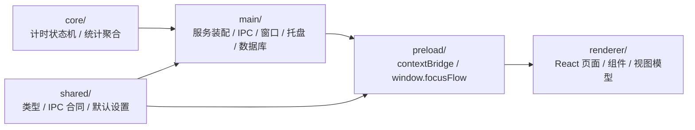

# FocusFlow

FocusFlow 是一个本地优先的 Windows 桌面番茄钟客户端，面向个人专注、任务绑定和本地统计场景。它把番茄钟、待办任务、专注统计、系统托盘、小窗和 Windows 通知整合在一个轻量桌面应用里。

项目以本地数据为核心，不依赖账号体系或云同步。源码按 `core -> services -> adapters -> UI` 分层组织，尽量把业务规则、桌面能力和 React 界面保持解耦。

<p align="center">
  
</p>


## 功能特性

**专注计时**

- 支持专注、短休、长休三个阶段。
- 支持开始、暂停、继续、跳过和重置。
- 支持自动开始休息、自动开始下一轮专注和长休间隔配置。
- 运行中或暂停中的计时被打断前会弹出确认，避免误操作。

**任务管理**

- 支持新增、行内编辑、完成、恢复和删除任务。
- 进行中任务支持拖拽排序。
- 当前专注可以绑定或解绑任务，也可以从待办页直接设为当前任务并开始专注。

**统计视图**

- 支持今日专注统计、小时分布、时间构成和专注时长榜。
- 支持月历热力图和按日期查看专注明细。
- 支持统计未绑定任务的专注时间。

**桌面体验**

- 支持主窗口和小窗模式，二者互斥显示。
- 支持系统托盘、关闭到托盘、启动到托盘和开机自启。
- 支持 Windows 通知、提示音、白天/黑暗/跟随系统主题。

**发布形态**

- 支持 Windows `nsis` 安装包。
- 支持 Windows `portable` 单文件便携版。
- 支持 `win-unpacked/` 展开版用于开发者烟测。

## 技术栈

- 桌面框架：Electron 34
- 前端界面：React 19 + TypeScript 5
- 本地数据：SQLite（via `sql.js`）
- 构建工具：electron-vite 5
- 测试：Vitest

## 快速开始

安装依赖：

```powershell
npm install
```

常用命令：

```powershell
npm run dev
npm run build
npm test
npm run preview
npm run package
```

命令说明：

- `npm run dev`：启动 Electron 开发态，用于本地开发和完整桌面能力验证。
- `npm run build`：执行 TypeScript 类型检查，并构建 main、preload、renderer 三端产物到 `output/build/`。
- `npm test`：运行 Vitest 测试。
- `npm run preview`：预览构建后的 Electron 应用。
- `npm run package`：先构建，再通过 `package-win.mjs` 执行 Windows 打包，产物输出到 `output/release/`。

直接在普通浏览器打开 renderer dev server 时只能看到浏览器态提示页；完整交互、托盘、窗口控制和 preload API 需要通过 Electron 窗口运行。

## 项目结构

```text
core -> services -> adapters -> UI
```

示意图：



关键目录：

- `core/`：纯业务逻辑层，不依赖 Electron、React 或 SQLite 具体实现；包含计时状态机和统计聚合逻辑。
- `main/`：Electron 主进程层，负责应用启动、服务装配、窗口、托盘、通知、设置、数据库和 IPC。
- `preload/`：通过 `contextBridge` 暴露有限 API 到 `window.focusFlow`，隔离 Electron 与渲染层。
- `renderer/`：React 渲染层，负责主窗口、小窗、计时页、待办页、统计页和设置页。
- `shared/`：共享类型、IPC channel、默认设置和窗口尺寸常量。

如果需要 AI coding agent 快速了解修改边界、验证策略和内部约定，请优先阅读 `CLAUDE.md`。

## 数据与发布

### 数据库

- 数据库文件名是 `focusflow.sqlite`，默认放在 Electron 的 `app.getPath('userData')` 目录下。
- Windows 常见位置是 `%APPDATA%/focusflow/focusflow.sqlite`；首次启动如果文件不存在，程序会自动创建空库并完成建表。
- 数据库不打进发布包。安装版、单文件便携版和 `win-unpacked/` 展开版默认共享同一个 `userData` 数据库位置，因此 `focusflow-single.exe` 不是数据便携包。
- 删除 `output/` 或重新打包不会删除用户数据；如需迁移数据，先退出 FocusFlow，再复制 `focusflow.sqlite` 到新电脑对应的 `userData` 目录。

### 输出目录与发布包

- `output/build/`：`npm run build` 生成的 Electron main、preload、renderer 构建产物。
- `output/release/`：安装包文件输出目录
  - `focusflow-setup.exe`：Windows 安装包，需要安装使用
  - `focusflow-single.exe`：Windows 单文件便携版，单文件双击运行
  - `win-unpacked/focusflow.exe`：展开版应用，主要用于开发者烟测
- `output/release/latest.yml` 和 `output/release/*.blockmap`：发布与更新相关元数据。
- `output/cache/electron-builder/`：`package-win.mjs` 使用的项目级 electron-builder cache。
- `output/` 是生成物目录，默认不提交；需要时可删除后通过 `npm run build` 或 `npm run package` 重新生成。
- Windows 打包通过根目录的 `package-win.mjs` 运行 `electron-builder --win nsis portable`，并通过兼容层稳定写入 exe 图标和版本资源。

### 干净 Windows 运行依赖

- 当前发布包面向 x64 Windows，建议在 Windows 10/11 x64 上运行。
- `focusflow-single.exe` 和 `focusflow-setup.exe` 都可以单独分发；如果使用 `win-unpacked/`，必须拷贝整个目录，不能只拷贝其中的 exe。
- 不需要预装 Node.js、npm、SQLite、WebView2 或项目依赖。Electron、Chromium、Node runtime，以及 `react`、`sql.js`、`electron-log` 等运行依赖都已随应用打包。
- `sql.js` 需要的 `sql-wasm.wasm` 已随应用一起打包，不依赖系统 SQLite。
- 新电脑需要允许写入 `%APPDATA%` 和 `%TEMP%`；单文件便携版会使用 `%TEMP%` 解包运行。
- Windows Defender、SmartScreen、企业安全策略或杀毒软件可能拦截未信任的新程序；这属于系统安全策略，不是缺少依赖。

## 开发约定

- 本项目默认在 Windows / PowerShell 环境开发；不要使用 bash 风格的 `&&` 串联命令。当前 `dev` 和 `preview` 脚本会自动清理 `ELECTRON_RUN_AS_NODE`。
- 业务规则优先放在 `core/` 和 `main/services/`，不要重新塞回 React 页面。
- 数据访问尽量走 repository；渲染层只依赖 preload 暴露的 `window.focusFlow` API，不直接触碰 Electron 主进程对象。
- 新增桌面能力时优先通过 `main/adapters` 和 `main/ports` 建模。
- 修改 Markdown、TypeScript、JSON 等编码敏感文件时，优先使用 UTF-8 安全写法，避免 PowerShell 默认编码造成中文内容异常。
