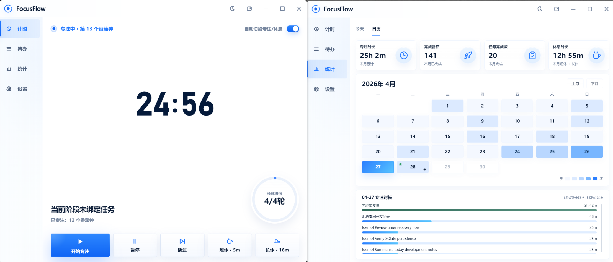
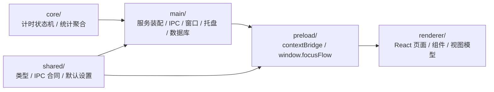

# FocusFlow

FocusFlow 是一个本地优先的 Windows 桌面番茄钟客户端，面向个人专注、任务绑定和本地统计场景。它把番茄钟、待办任务、专注统计、系统托盘、小窗和 Windows 通知整合在一个轻量桌面应用里。

项目以本地数据为核心，不依赖账号体系或云同步，保持业务规则、桌面能力和 React 界面的解耦。

- 本地优先：数据默认保存在当前 Windows 用户目录，不依赖账号或云端服务。
- 任务绑定：每次专注可以绑定任务，也支持未绑定任务的纯专注记录。
- 统计完整：支持今日统计、小时分布、任务排行和月历热力图。
- 桌面体验：支持系统托盘、小窗、通知、提示音和主题切换。

<p align="center">
  
</p>

## 快速开始

安装依赖：

```powershell
npm install
```

常用命令：

```powershell
npm run dev
npm run build
npm test
npm run preview
npm run package
npm run package:appx:dev
```

命令说明：

- `npm run dev`：本地开发首选命令，直接启动完整 Electron 应用，适合验证托盘、窗口控制、通知和 preload API。
- `npm run build`：执行 TypeScript 类型检查，并构建 main、preload、renderer 三端产物到 `output/build/`。
- `npm test`：运行 Vitest 测试。
- `npm run preview`：预览构建后的 Electron 应用。
- `npm run package`：默认 Windows 发布链路，产出 `nsis + portable`，输出到 `output/release/`。
- `npm run package:appx:dev`：唯一 AppX 打包入口，内部会自动准备或复用本地开发证书，并产出当前机器可直接安装的签名 `appx`。

## 技术栈

- 桌面框架：Electron 34
- 前端界面：React 19 + TypeScript 5
- 本地数据：SQLite（via `sql.js`）
- 构建工具：electron-vite 5
- 测试：Vitest

## 项目结构

```text
core -> services -> adapters -> UI
```

示意图：



关键目录：

- `core/`：纯业务逻辑层，不依赖 Electron、React 或 SQLite 具体实现；包含计时状态机和统计聚合逻辑。
- `main/`：Electron 主进程层，负责应用启动、服务装配、窗口、托盘、通知、设置、数据库和 IPC。
- `preload/`：通过 `contextBridge` 暴露有限 API 到 `window.focusFlow`，隔离 Electron 与渲染层。
- `renderer/`：React 渲染层，负责主窗口、小窗、计时页、待办页、统计页和设置页。
- `shared/`：共享类型、IPC channel、默认设置和窗口尺寸常量。

如果需要 AI coding agent 快速了解修改边界、验证策略和内部约定，请优先阅读 `CLAUDE.md`。

## 数据与发布

### 数据库

- 数据库文件名是 `focusflow.sqlite`，默认放在 Electron 的 `app.getPath('userData')` 目录下，常见路径是 `%APPDATA%/focusflow/focusflow.sqlite`。
- 首次启动如果 `focusflow.sqlite` 不存在，程序会自动创建空库并完成建表。
- 数据库不打进发布包；删除 `output/` 或重新打包不会删除用户数据。
- 如需迁移数据，先退出 FocusFlow，再复制 `focusflow.sqlite` 到新电脑对应的 `userData` 目录。
- 安装版、单文件便携版、`appx` 包和 `win-unpacked/` 展开版默认共享同一个 `userData` 数据库位置

### 输出目录与发布包

- `output/` 是生成物目录，需要时可删除后通过 `npm run build`、`npm run package` 或 `npm run package:appx:dev` 重新生成。
- `output/build/`：`npm run build` 生成的 Electron main、preload、renderer 构建产物。
- `output/release/focusflow-setup.exe`：Windows 安装包，需要安装使用。
- `output/release/focusflow-single.exe`：Windows 单文件便携版，双击即可运行。
- `output/release/focusflow-appx.appx`：微软商店安装包。
- `output/release/win-unpacked/focusflow.exe`：展开版应用，主要用于开发者烟测。
- `output/release/latest.yml` 和 `output/release/*.blockmap`：发布与更新相关元数据。
- `output/cache/electron-builder/`：`package-win.mjs` 使用的项目级 `electron-builder` cache。
- Windows 打包通过根目录的 `package-win.mjs` 驱动 `electron-builder`；默认无参数时打 `nsis portable`，显式传 `appx` 时只打 `appx`。

### 运行依赖

- 当前发布包面向 x64 Windows，建议在 Windows 10/11 x64 上运行。
- `focusflow-setup.exe` 和 `focusflow-single.exe` 都可以单独分发；如果使用 `win-unpacked/`，必须拷贝整个目录，不能只拷贝其中的 exe。
- 不需要预装 Node.js、npm、SQLite、WebView2 或项目依赖。Electron、Chromium、Node runtime，以及 `react`、`sql.js`、`electron-log` 等运行依赖都已随应用打包。
- `sql.js` 需要的 `sql-wasm.wasm` 已随应用一起打包，不依赖系统 SQLite。
- 新电脑需要允许写入 `%APPDATA%` 和 `%TEMP%`；单文件便携版会使用 `%TEMP%` 解包运行。
- Windows Defender、SmartScreen、企业安全策略或杀毒软件可能拦截未信任的新程序；这属于系统安全策略，不是缺少依赖。
