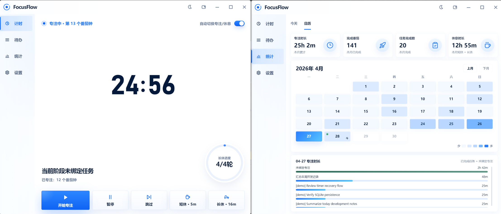
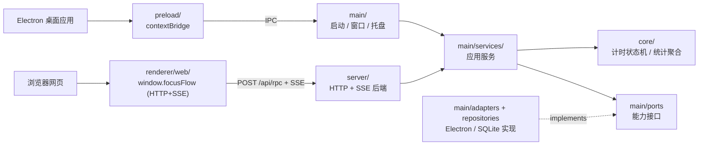

# FocusFlow

[](https://github.com/gis2all/focus-flow/actions/workflows/ci.yml?query=branch%3Amain) [](https://github.com/gis2all/focus-flow/actions) [](https://gis2all.github.io/focus-flow/) [](LICENSE)

FocusFlow 是一个本地优先的番茄钟客户端：既提供桌面应用，也可作为可访问的网页运行。核心场景是个人专注、任务绑定和本地统计。它把番茄钟、待办任务、专注统计、系统托盘、小窗和 Windows 通知整合在一个轻量应用里；同一套界面在浏览器中也能使用。

项目以本地数据为核心，不依赖账号体系或云同步，保持业务规则、桌面能力和 React 界面的解耦。

- 本地优先：数据默认保存在本机，不依赖账号或云端服务。
- 双形态：桌面应用 + 浏览器网页模式（同一套界面、同一套业务逻辑）。
- 任务绑定：每次专注可以绑定任务，也支持未绑定任务的纯专注记录。
- 统计完整：今日统计、小时分布、任务排行和月历热力图。
- 桌面体验：系统托盘、小窗、通知、提示音和主题切换（网页端相应降级）。

<p align="center">
  
</p>

## 下载与安装

从 [GitHub Releases](https://github.com/gis2all/focus-flow/releases/latest) 下载最新版本：

- `focusflow-setup.exe`：标准安装向导，适合大多数用户。
- `focusflow-single.exe`：无需安装的单文件便携版。

如果 Windows Defender 或 SmartScreen 显示安全提示，请先确认下载地址来自本仓库的 GitHub Releases。

## 开发与验证

开发环境：Windows 10/11 x64、Node.js 22（含 npm），安装依赖用 `npm ci`。

| 用途 | 命令 | 说明 |
| --- | --- | --- |
| 安装依赖 | `npm ci` | 按 `package-lock.json` 干净安装 |
| 桌面应用 | `npm run dev` | Electron 开发态，验证托盘 / 窗口控制 / 通知 / preload |
| 网页模式 | `npm run web:start` | 构建并托管，浏览器打开 http://localhost:5274 |
| 网页开发态 | `npm run web:dev` | 渲染层 5273 + API/SSE 5274，带 HMR |
| 测试 | `npm test` | Vitest 单元 / 组件测试 |
| 发布 | `npm run package` | 产出 `output/release/` 安装包与便携版 |

其余命令（`test:coverage`、`test:e2e`、`test:package-smoke`、`package:appx:dev`、`web:build` 等）与验证边界见 [`CLAUDE.md`](CLAUDE.md)。

## 技术栈

- 桌面框架：Electron 41
- 前端界面：React 19 + TypeScript 5
- 本地数据：SQLite（via `sql.js`）
- 构建工具：electron-vite 5 + Vite 7
- 测试：Vitest 4 + Playwright 1.61

## 项目结构

桌面端与网页端共享同一套 `core/`、`main/services/` 与 `shared/`，只是传输层不同：

```text
桌面：Renderer -> Preload/IPC -> Main services
网页：Renderer -> renderer/web (HTTP+SSE) -> server/ -> Main services
两条传输链都复用 Core / shared（业务规则与共享类型/常量）
```

示意图：


```mermaid
flowchart LR
  Desktop["Electron 桌面应用"] --> Preload["preload/<br/>contextBridge"]
  Preload -->|IPC| Main["main/<br/>启动 / 窗口 / 托盘"]
  Web["浏览器网页"] --> WebApi["renderer/web/<br/>window.focusFlow (HTTP+SSE)"]
  WebApi -->|POST /api/rpc + SSE| Server["server/<br/>HTTP + SSE 后端"]
  Main --> Services["main/services/<br/>应用服务"]
  Server --> Services
  Services --> Core["core/<br/>计时状态机 / 统计聚合"]
  Services --> Ports["main/ports<br/>能力接口"]
  Adapters["main/adapters + repositories<br/>Electron / SQLite 实现"] -. implements .-> Ports
```

关键目录：

- `core/`：纯业务逻辑层，不依赖 Electron、React 或 SQLite 具体实现；包含计时状态机和统计聚合逻辑。
- `main/`：Electron 主进程层，负责应用启动、服务装配、窗口、托盘、通知、设置、数据库和 IPC。
- `preload/`：通过 `contextBridge` 暴露有限 API 到 `window.focusFlow`，隔离 Electron 与渲染层。
- `server/`：Web 后端，复用 `core/` 与 `main/services/`，提供 HTTP + SSE，作为网页端计时状态权威。
- `renderer/`：React 渲染层，负责主窗口、小窗、计时页、待办页、统计页和设置页。
- `renderer/web/`：浏览器端 `window.focusFlow`（HTTP + SSE）实现与通知/提示音。
- `shared/`：跨 main/preload/renderer/server 共享的类型、IPC channel、默认设置和窗口尺寸常量。

AI coding agent 请优先阅读 [`CLAUDE.md`](CLAUDE.md)，了解修改边界、业务路由和验证策略。
