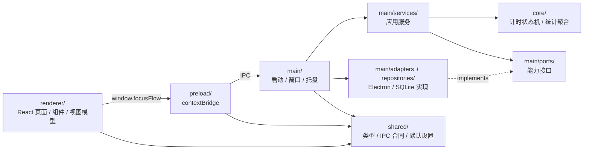

# FocusFlow

[](https://github.com/gis2all/focus-flow/actions/workflows/ci.yml?query=branch%3Amain) [](https://github.com/gis2all/focus-flow/actions) [](https://gis2all.github.io/focus-flow/) [](LICENSE)

FocusFlow 是一个本地优先的 Windows 桌面番茄钟客户端，面向个人专注、任务绑定和本地统计场景。它把番茄钟、待办任务、专注统计、系统托盘、小窗和 Windows 通知整合在一个轻量桌面应用里。

项目以本地数据为核心，不依赖账号体系或云同步，保持业务规则、桌面能力和 React 界面的解耦。

- 本地优先：数据默认保存在当前 Windows 用户目录，不依赖账号或云端服务。
- 任务绑定：每次专注可以绑定任务，也支持未绑定任务的纯专注记录。
- 统计完整：支持今日统计、小时分布、任务排行和月历热力图。
- 桌面体验：支持系统托盘、小窗、通知、提示音和主题切换。

<p align="center">
  
</p>

## 下载与安装

从 [GitHub Releases](https://github.com/gis2all/focus-flow/releases/latest) 下载最新版本：

- `focusflow-setup.exe`：标准安装向导，适合大多数用户。
- `focusflow-single.exe`：无需安装的单文件便携版。

如果 Windows Defender 或 SmartScreen 显示安全提示，请先确认下载地址来自本仓库的 GitHub Releases。

## 开发与验证

开发环境要求：

- Windows 10/11 x64
- Node.js 22（包含 npm）

安装依赖：

```powershell
npm ci
```

常用命令：

```powershell
npm run dev
npm run build
npm test
npm run test:e2e
npm run preview
npm run package
npm run test:package-smoke
npm run package:appx:dev
```

命令说明：

- `npm run dev`：本地开发首选命令，直接启动完整 Electron 应用，适合验证托盘、窗口控制、通知和 preload API。
- `npm run build`：执行 TypeScript 类型检查，并构建 main、preload、renderer 三端产物到 `output/build/`。
- `npm test`：运行 Vitest 测试。
- `npm run test:e2e`：构建并启动真实 Electron，验证沙箱、IPC、任务计时和重启持久化。
- `npm run preview`：预览构建后的 Electron 应用。
- `npm run package`：默认 Windows 发布链路，产出标准安装向导版 `nsis` 安装包和 `portable` 单文件版，输出到 `output/release/`。运行前需要退出从该目录启动的 FocusFlow 实例。
- `npm run test:package-smoke`：启动 `win-unpacked` 中的新打包应用，检查产物、发布元数据和 preload API；需要先成功运行 `npm run package`。
- `npm run package:appx:dev`：唯一 AppX 打包入口，内部会自动准备或复用本地开发证书，并产出当前机器可直接安装的签名 `appx`。

## 技术栈

- 桌面框架：Electron 41
- 前端界面：React 19 + TypeScript 5
- 本地数据：SQLite（via `sql.js`）
- 构建工具：electron-vite 5 + Vite 7
- 测试：Vitest 4 + Playwright 1.61

## 项目结构

```text
Renderer -> Preload/IPC -> Main services -> Ports/Adapters
                                  |
                                 Core
```

示意图：


```mermaid
flowchart LR
  Renderer["renderer/<br/>React 页面 / 组件 / 视图模型"] -->|window.focusFlow| Preload["preload/<br/>contextBridge"]
  Preload -->|IPC| Main["main/<br/>启动 / 窗口 / 托盘"]
  Main --> Services["main/services/<br/>应用服务"]
  Services --> Core["core/<br/>计时状态机 / 统计聚合"]
  Services --> Ports["main/ports/<br/>能力接口"]
  Adapters["main/adapters + repositories/<br/>Electron / SQLite 实现"] -. implements .-> Ports
  Main --> Adapters
  Renderer --> Shared["shared/<br/>类型 / IPC 合同 / 默认设置"]
  Preload --> Shared
  Main --> Shared
```

关键目录：

- `core/`：纯业务逻辑层，不依赖 Electron、React 或 SQLite 具体实现；包含计时状态机和统计聚合逻辑。
- `main/`：Electron 主进程层，负责应用启动、服务装配、窗口、托盘、通知、设置、数据库和 IPC。
- `preload/`：通过 `contextBridge` 暴露有限 API 到 `window.focusFlow`，隔离 Electron 与渲染层。
- `renderer/`：React 渲染层，负责主窗口、小窗、计时页、待办页、统计页和设置页。
- `shared/`：共享类型、IPC channel、默认设置和窗口尺寸常量。

如果需要 AI coding agent 快速了解修改边界、验证策略和内部约定，请优先阅读 [`CLAUDE.md`](CLAUDE.md)。
